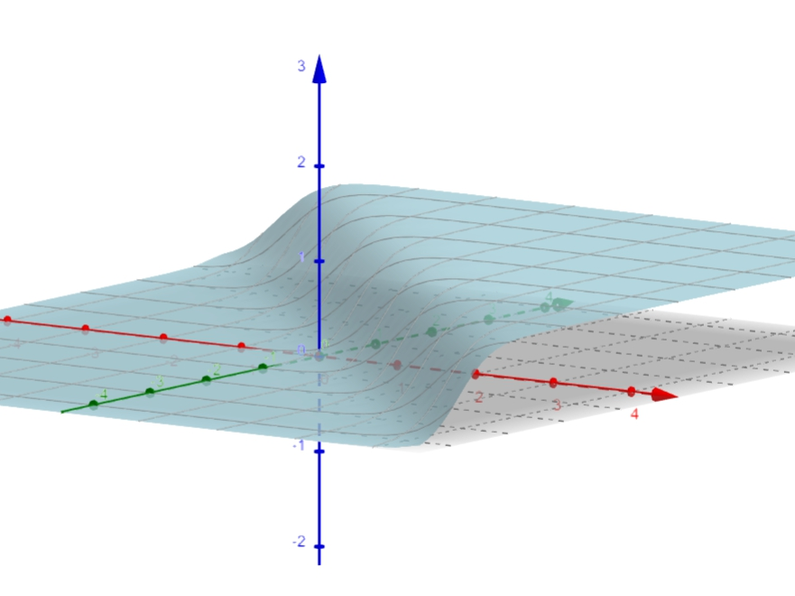
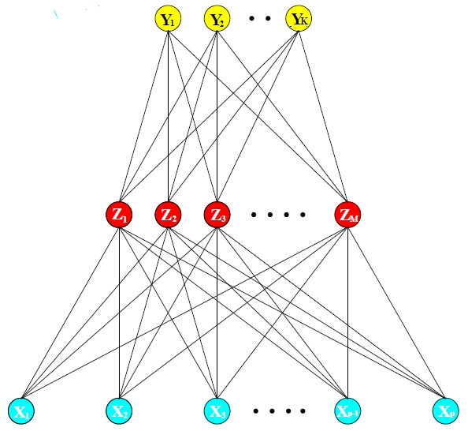
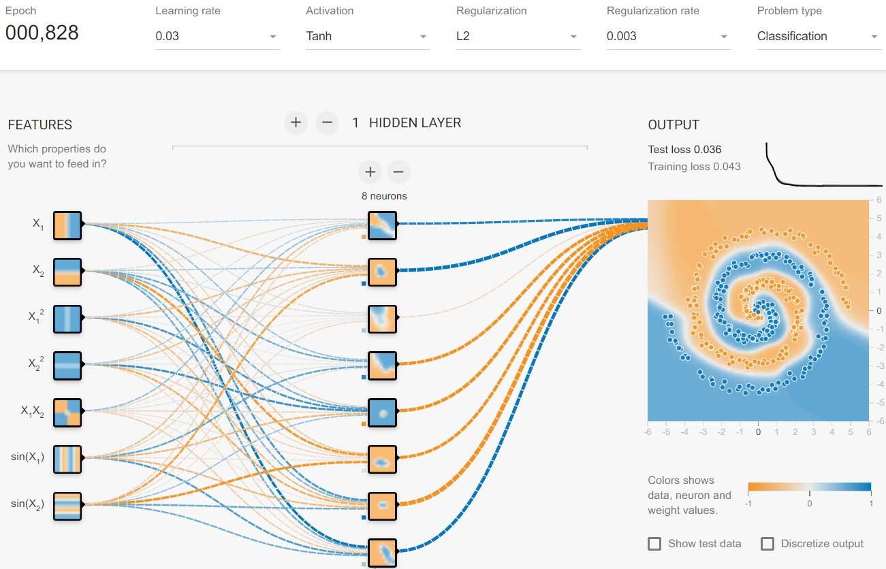

class: title-slide, left, bottom, inverse
background-image: linear-gradient(to bottom, rgba(255,255,255,0.4) 0%, rgba(255,255,255,0.4) 100%), url("https://miro.medium.com/max/3000/1*m2gDBT_nc-iE7R4AM3sHBQ.jpeg")
.bg-text[
# <big><font color = "white">NEURAL NETWORK</font></big>
## <big><font color = "white">ESL</font></big>
<hr />
`r format(Sys.Date(), "%B %d %Y")` <br/>
陳懷安
]
---
```{r setup, include=FALSE}
options(htmltools.dir.version = FALSE)

```

# Intro.  

- 將解釋變數的線性組合作為*derived features*  

- 接著透過這些<mark>特徵</mark>(*features*)的非線性函數建模  


---
class: center, middle
background-image: url("https://thumbs.gfycat.com/HealthyPerfectHaddock-small.gif")
background-size: cover

# <font color = "white">Projection Pursuit Regression</font>  
## <font color = "white">投影追蹤迴歸</font>  

---
# Projection Pursuit Regression<sup>1</sup>

.left-column[
## Model  
]

.right-column[.small[
$$\large{f(X)=\sum_{m=1}^M \color{blue}{g_m(w_m^TX)} \tag{1.1}}$$   $$where \ g:\mathbb{R} \rightarrow\mathbb{R}, and \  w\in\mathbb{R}^p \backslash \lbrace0\rbrace$$]  
--
其中 $\color{blue}{g_m(w_m^TX)}$為嶺函數([*ridge function*](https://www.encyclopediaofmath.org/index.php/Ridge_function)<sup>2</sup>)，目的是將 $X$投影在 $w$方向向量上，透過 $g$作用後的加總來逼近迴歸函數。  

]

.small[.footnote[
<font size="2">
[1] Friedman, J.H. and Stuetzle, W. (1981) Projection Pursuit Regression. Journal of the American Statistical Association.<br/>
[2] B. F. Logan and L. A. Shepp (1975). Optimal Reconstruction of a Function From Its Projections. Duke Mathematical Journal.<br/>  
&nbsp &nbsp &nbsp <b>Ridge function is a multivariate function constant on the parallel hyperplanes $wX=c,\ c\in\mathbb{R}.$</b>
</font>
]]
---

# Projection Pursuit Regression
.left-column[
## Model
## Example 
]
  
.right-column[
課本範例：  
.center[
<br/>
.center[fig. 1 ridge functiom]
$$w^T = \frac{1}{\sqrt2}\left[\matrix{1 \\ 1}\right], \ V=w^TX, \ V=\frac{X_1+X_2}{\sqrt{2}} \\ g(V)=1/(1+\exp(-5(V-0.5))$$]]


---
# Projection Pursuit Regression
.left-column[
## Model  
## Example 
## Estimation
]

.right-column[
$$min\ \sum_{i=1}^N \left[y_i-\sum_{m=1}^M g_m(w_m^TX)\right]\tag{1.2}$$  
- $\color{blue}{估計\ g}$  
給定 $w$，透過平滑算法，如:*smoothing spline*，得到 $\hat{g}$。
- $\color{blue}{估計\ w}$  
利用Gauss-Newton法，我們有
$$g(w_m^Tx_i)\approx g(w_{old}^Tx_i)+g'(w_{old}^Tx_i)(w-w_{old})^Tx_i$$  
代回 $(1.2)$，解極小化問題得 $w_{new}$。  

- $\color{blue}{反覆迭代}$上兩個步驟直到結果收斂。
]


.footnote[
<font size="2"><a href="http://citeseerx.ist.psu.edu/viewdoc/download?doi=10.1.1.228.6416&rep=rep1&type=pdf">Allan Pinkus. Approximating By Ridge Functions.</a></font>
]
???
高斯牛頓法捨棄H的二階偏導數，處理當該項計算困難時的狀況。利用一階導數資訊去逼近。 前提是殘差需接近線性函數或是0，否則不會收斂。  
- 基本上，任意平滑篹法都可以適用。  
- 對於 $M$，可以透過交叉驗證(CV)來決定。  
- 之所以沒被廣泛使用，提出當時(1981)，計算機的計算能力還不夠強。
---
class: middle, center  
background-image: linear-gradient(to bottom, rgba(255,255,255,0.4) 0%, rgba(255,255,255,0.4) 100%), url("https://ak5.picdn.net/shutterstock/videos/9053965/thumb/1.jpg")  
background-size: cover
# <font style="background: rgba(100%,100%,100%,0.6)">Neural Network</font> 
## 類神經網路  
---
# Neural Network  
.pull-left[
- 基本型態(*vanilla*)的類神經網路  
  - single hidden layer back-propogation network  
    
  - single layer perceptron  
- non-linear statistical model  
<br/><br/>
右圖為一個單隱藏層K類的分類模型。
]  

.pull-right[
<br/>
.center[fig. 2 network diagram]
]  

---
## NN Model  
模型如下：  
<br/>

$$\large{\large{\begin{align}Z_m&=\color{blue}{\sigma}(\alpha_{0m}+\alpha_m^TX),\ m=1,...,M \\ T_k&=\beta_{0k}+\beta_k^TZ,\ k=1,...,K\\ f_k(X)&=g_k(T),\ k=1,...,K\tag{2.1}\end{align}}}$$
  
  
   
--


- 激勵函數(*activation function*<sup>4</sup>) $\color{blue}{\sigma(v)}$，如： $\sigma(v)=1/(1+e^{-v})$。  
- $g_k(X)$作為最後的轉換函數。  
  - 在迴歸中，一般就採用 $g_k(T) = T$  
  
  - 分類模型，使用*softmax function*<sup>3</sup>會比較好  

.footnote[
<font size="2">[3] $g_k(T)=e^{Tk}/\sum^K_{l=1}e^Tk$</font><br/>
<font size="2">[4] 較早期的模型在 $\sigma(Z),\ g_m(T)$多採用階梯函數(<i>step function</i>)。之後類神經網路用來做非線性統計建模時，階梯函數在優化上就不如一些閾值較平滑的函數。</font>
]

???


ReLU可以克服sigmoid, tanh的梯度消失問題  
也可以讓網路變得稀疏，避免過度配適  
節省計算量  
但會有dead ReLU problem產生 >> Leaky ReLU, rand. ReLU, Maxout...  

---
## Activation Function  
.pull-left[
```YAML
library(ggplot2)
sigmoid <- function(x) {
  return(1 / (1 + exp(-x)))
  }
ReLU <- function(x) {
  ifelse(x < 0, 0, x)
  }
LReLU <- function(x) {
  ifelse(x < 0, 0.1 * x, x)
  }
tanh <- function(x) {
  return(2 / (1 + exp(-2 * x)) - 1)
  }

ggplot() +
  stat_function(aes(x = -2:2, colour = "sigmoid"), fun = sigmoid) +
  stat_function(aes(x = -2:2, colour = "ReLU"), fun = ReLU) +
  stat_function(aes(x = -2:2, colour = "LReLU"), fun = LReLU) +
  stat_function(aes(x = -2:2, colour = "tanh"), fun = tanh) +
  scale_colour_manual("Activation Func.",
    values = c("sigmoid" = "red", "ReLU" = "blue", "LReLU" = "green", "tanh" = "brown"))
```
]
.pull-right[
```{R echo = F, fig.width=13, fig.height=14}
library(ggplot2)
sigmoid <- function(x){ return(1/(1+exp(-x)))}
ReLU <- function(x){ifelse(x<0, 0,x)}
LReLU <- function(x){ifelse(x<0,0.1*x,x)}
tanh <- function(x){ return(2/(1+exp(-2*x))-1)}

ggplot() + 
  stat_function(aes(x=-2:2, colour = "sigmoid"), fun = sigmoid, size=4) +
  stat_function(aes(x=-2:2, colour = "ReLU"), fun = ReLU, size=4) +
  stat_function(aes(x=-2:2, colour = "LReLU"), fun = LReLU, size=2) +
  stat_function(aes(x=-2:2, colour = "tanh"), fun = tanh,size=3) +
  scale_colour_manual("Activation Func.", values = c("sigmoid" ="red","ReLU" = "blue", "LReLU" = "green", "tanh" = "brown"))+
  theme_bw() +
  theme(text = element_text(size=25), legend.background = element_rect(colour = "grey", linetype = "dashed"), legend.position = "bottom") +
  labs(x = "x")
```
]  

  
???
Leaky ReLU 避免dead ReLU problem  
---
## Equivalent To PPR  
For single-layer network, say $g_k(T) = T_k$is identity function.  

$$\large{\begin{align*}f_k(X)=g_k(T)=T_k&=\beta_{0k}+\sum_{m=1}^M\beta_{km}^TZ_m\\ &=\beta_{0k}+\sum_{m=1}^M\beta_{km}^T\sigma(\alpha_{0m}+\alpha_m^TX)\\ &=\sum_{m=0}^M\beta_{km}^T\sigma(\alpha_{0m}+||\alpha_{m}||(w_m^TX))\tag{2.2}\end{align*}}$$  
--
So it is equivalent to PPR with $\color{blue}{g_m(w_m^TX)=\beta_{km}^T\sigma(\alpha_{0m}+||\alpha_{0m}||(w_m^TX))}$ for the $\color{blue}{m_{th}}$output.  
<br/>
我們可以將其看做一個三個參數的模型<sup>5</sup> $\sigma_{\color{blue}{\beta,\alpha_0,s}}(v)=\beta\sigma(\alpha_0+sv)$，比起PPR的 $g(v)$單純很多。  
  
  
.footnote[
<font size="2">[5] A. Pinkus, "Approximation theory of the MLP model in neural networks" Acta Numerica.</font>
]
  
???
因此不難想像為何NN動輒幾十層。  

---
# Fitting Neural Network  
.left-column[
## Loss Function
]


.right-column[
- 損失(*Loss*) = 殘差  

.pull-left[

<h3>Regression</h3>  
- MSE  
  - $\large{R(\theta)=\frac{\sum(y_i-\hat{y_i})^2}{n}}$
- MAE  
  - $\large{R(\theta)=\frac{\sum|y_i-\hat{y_i}|}{n}}$  
  
- Huber Loss   

]

.pull-right[
<h3>Classification</h3>  
- Cross Entropy  
  - $R(\theta)=\sum\sum -y_{c,i}\log(p_{c,i})$  
  
- Focal Loss<sup>6</sup>   

]
]
  

.footnote[
<font size="2">[6] Tsung-Yi Lin, Priya Goyal, Ross Girshick, Kaiming He, Piotr Dollar. (2017). Focal Loss for Dense Object Detection. Facebook AI Research.</font>
]
???
Huber  
調和MSE、MAE  

$$Loss(y,\hat{y}) = \begin{equation} \left\{ \begin{array}{**lr**} \frac{1}{2}(y-\hat{y})^2,&  |y-\hat{y}|\leq\delta \\ \delta(|y-\hat{y}|-\frac{1}{2}\delta),& O.W. \end{array} \right. \end{equation}$$  

$\alpha$-balance Focal Loss  
給CE加上權重  

$$FL (p_t)= -\alpha(1-p_t)^\gamma \log(p_t)$$  
where $\gamma$ is focusing parameter.  
---
# Fitting Neural Network  
.left-column[
## Loss Function  
## Back Propagation<sup>7</sup>  
]  

.right-column[
> 與一般模型一樣，我們需要極小化損失函數來提升模型的準確率。但模型不像傳統迴歸問題那樣，而是可能包含許多隱藏層，因此需要逐層調整。剛好，透過大家都會的連鎖率(*chain rule*)可以輕鬆做到。  

]  
.footnote[
<font size="2">[7] David E. Rumelhart, Geoffrey E. Hinton, and Ronald J. Williams. (1985). Learning Internal Representation by Error Propagation.</font>
]
---
# Fitting Neural Network  
.left-column[
## Loss Function  
## Back Propagation  
]  
.right-column[
$$\small{R(\theta)=\sum_{i=1}^N \sum_{k=1}^K(y_{ik}-g_k(\beta_0+\beta_k^T(\sigma(\alpha_{0m}+\alpha_m^Tx_i))))^2\tag{2.3}}$$
分別對 $\alpha,\ \beta$微分，  
$$\small{\begin{align*} \dfrac{\partial R_i}{\partial \beta_{km}} = -2&\color{blue}{(y_{ik}-f_k(x_i))g_k'(\beta_{0k}+\beta_k^Tz_i)}z_{mi} \\ \dfrac{\partial R_i}{\partial \alpha_{m\ell}} =-2\sum_{k=1}^K&\color{blue}{(y_{ik}-f_k(x_i))g_k'(\beta_{0k}+\beta_k^Tz_i)}\beta_{km}\sigma'(\alpha_{0m}+\alpha_m^Tx_i)x_{i\ell}\end{align*}\tag{2.4}}$$  
因此在第( $r+1$)步時，迭代更新為  

$$\small{\begin{align*}\beta_{km}^{(r+1)}&=\beta_{km}^{(r)}-\gamma_r\sum_{i=1}^N \dfrac{\partial R_i}{\partial \beta_{km}^{(r)}} \\ \alpha_{m\ell}^{(r+1)}&=\alpha_{m\ell}^{(r)}-\gamma_r\sum_{i=1}^N \dfrac{\partial R_i}{\partial \alpha_{m\ell}^{(r)}}\end{align*} \tag{2.5}}$$
]
---
# Fitting Neural Network  
.left-column[
## Loss Function  
## Back Propagation  
]  

.right-column[
改寫 (2.4)，  
$$\begin{align*} \dfrac{\partial R_i}{\partial \beta_{km}} = \delta_{ki}z_{mi} \\ \dfrac{\partial R_i}{\partial \alpha_{m\ell}} =s_{mi}x_{i\ell}\end{align*}\tag{2.6}$$
由 (2.4)，我們可以得到  
$$\small{s_{mi}=\sigma'(\alpha_{0m}+\alpha^T_mx_i)\sum_{k=1}^K\beta_{km}\delta_{ki}\tag{2.7}}$$  
> 通過上式，我們能完成一套 *two-pass*過程。首先 *forward pass*的部分，給定權重計算出 $\hat{f_k}(x_i)$； *backward pass*則是透過(2.4)、(2.5)去進行權重的更新，這套流程也就是<font color = "blue"><b>向後傳播</b></font>。

]
---
# Fitting Neural Network  
.left-column[
## Loss Function  
## Back Propagation  
## Example
]  

.right-column[
.center[
[](https://playground.tensorflow.org/)  
fig 3. Neural Network Model
]
]
---
# Fitting Neural Network  
.left-column[
## Loss Function  
## Back Propagation  
## Example
]  


.right-column[
> 1 hidden layer with 8 neurons  

.pull-left[
.center[
  
fig 4. online learning
]  
]

.pull-right[
.center[
  
fig 5. batch size 19
]
]


]
---
# Fitting Neural Network  
.left-column[
## Loss Function  
## Back Propagation  
## Example
]  


.right-column[
> 4 hidden layers, each with 5 neurons  

.pull-left[
.center[
  
fig 6. online learning
]  
]

.pull-right[
.center[
  
fig 7. batch size 10
]
]


]
---
# Issues  
.left-column[
## Starting Values
]

.right-column[
.center[
```{R echo = F, fig.width=8, fig.height=4}
library(ggplot2)
sigmoid <- function(x){ return(1/(1+exp(-x)))}
sigmoid_0.3 <- function(x){ return(1/(1+exp(-(3/10)*x)))}
sigmoid_10 <- function(x){ return(1/(1+exp(-10*x)))}

ggplot() + 
  stat_function(aes(x=-5:5, colour = "sigmoid"), fun = sigmoid, size=2) +
  stat_function(aes(x=-5:5, colour = "sigmoid_0.3"), fun = sigmoid_0.3, size=2, linetype="dotted") +
  stat_function(aes(x=-5:5, colour = "sigmoid_10"), fun = sigmoid_10, size=2, linetype="dashed") +
  scale_colour_manual("Activation Func.", values = c("sigmoid_0.3" ="purple", "sigmoid_10" ="blue", "sigmoid" ="red"))+
  theme_bw() +
  theme(text = element_text(size=18), legend.background = element_rect(colour = "grey", linetype = "dashed"), legend.position = "right") +
  labs(x = "x")
```
  
fig 8. sigmoid function
]
- 上圖為 $\sigma(sx)=1/(1+\exp(-sx))$, $s$ 分別為 $1, 0.3, 10$。  
一般都會以一個接近零的數字開始，讓模型逐步從近似線性到非線性。  
- 可以設定  
$$\large{w_i \sim \rm{U(-0.7, 0.7)}}$$

]

???
playground NN +-0.5
---
# Issues  
.left-column[
## Starting Values  
## Overfitting
]

.right-column[
為避免模型過度配適，通常會採用以下方法
- <font color = "blue">提前結束訓練</font> 觀察驗證資料集，當error開始上升的時候就可以停止訓練了。  
- <font color = "blue">正規化(<i>Regularization</i>)</font> ，將懲罰項(*Penalty*)加入*loss function*  
$$\large{Loss Function = R(\theta)+\lambda\color{blue}{J(\theta)}} \\ \small{\lambda 在這裡為一個調整參數，值越大，權重縮減幅度越大。}$$  
  - <font color = "blue">*weight decay*</font>: $J(\theta)=\sum {w_i}^2$  
  
  - <font color = "blue">*weight elimination*</font><sup>8</sup>: $J(\theta)=\sum (w_i/w_0)^2/(1+(w_i/w_0)^2)$  
- <font color = "blue"><b><i>Drop-out</i></b></font> ...
]

.footnote[
<font size="2">[8] Andreas S. Weigend, David E. Rumelhart, Bernardo A. Huberman. (1991). Generalization by Weight-Elimination with Application to Forecasting. Advances in Neural Information Processing Systems. <br/>為了解決<i>weight decay</i>遺留下來很多數字小但非0的權重，又要兼具L2容易微分的優點。</font>
]
---
# Issues  
.left-column[
## Starting Values  
## Overfitting  
## Scaling
]

.right-column[
- 在自變數的處理上可以先標準化，避免在正規化的過程，受到數值規模不同的干擾。  
  
]
---
# Issues  
.left-column[
## Starting Values  
## Overfitting
## Scaling  
## The Hiddens  
]

.right-column[
- 一般來說，隱藏單元(*hidden units*)是<font color = "blue">多多益善</font>，只要能搭配合適的正規化操作。  
  
- 依靠背景知識、過往經驗等等來決定要設定幾層隱藏層。  

- 增加神經元(*neuron*)可以提升模型的解釋能力及複雜度<sup>9</sup>。  

- 增加隱藏層可能可以提升模型準確率(*accuracy*)，但過多可能會造成預測力下降。  
]  

.footnote[
<font size="2">[9] Ian Goodfellow, Yoshua Bengio and Aaron Courville. (2016). Deep Learning. MIT Press.</font>
]

???

有人可能會說用CV來估計需要多少隱藏層、單元，但作者認為沒有必要。  
---
# Issues  
.left-column[
## Overfitting
## Scaling  
## The Hiddens  
## Multiple Minima  
]

.right-column[
> 基於 $R(\theta)$為非凸函數，會存在許多局部極小值(*local minimum*)，要找到真正的極小值是困難的。  

解決這個問題：  
- bagging  
- 提升學習率(*learning rate*)  
  
- 嘗試其他[演算法](http://ruder.io/optimizing-gradient-descent/)  
- 不管他<sup>10</sup>。當模型漸趨複雜，過於追求<font color = "blue">真正的</font>最小值(*global minimun*)，往往會造成過度配適的問題發生。
]

.footnote[
<font size="2">[10] Anna Choromanska, Mikael Henaff, Michael Mathieu, G´erard Ben Arous and Yann LeCun. (2015). The Loss Surfaces of Multilayer Networks. Journal of Machine Learning Research.</font>
]
---
# Example  

Here's the [example](https://ggg5269.github.io/slide4ML/ex11_6.html) for 11.6.   

---
# Discussion  

>適用於高訊號雜訊比(signal-to-noise ratio)且不需要針對預測結果去做解釋的情況。
---

CNN 模仿視覺，分析局部特徵  透過matching、pooling等過程  
RNN 考慮前後關係，常應用在NLP  

